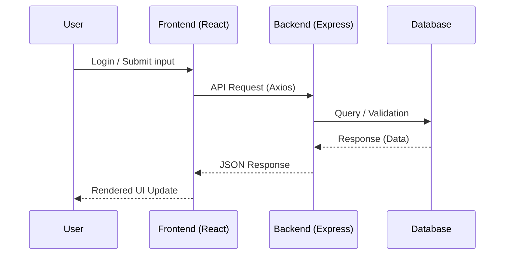

# Project Details

## 1. Project Overview
This application is a full-stack project built to manage user authentication, project data, and frontend–backend integration.  
It provides a structured way to handle users, secure requests, and interact with a project management system.  

**Tech Stack**:  
- **Frontend**: React (with Auth system, Screens, Axios API config)  
- **Backend**: Node.js, Express (with routes, services, environment configs)  
- **Database**: MongoDB 

---

## 2. Features

### Frontend
- Multiple screens: Login, Home, Project, etc.  
- Authentication integration via [`UserAuth.jsx`](frontend/src/auth/UserAuth.jsx).  
- Centralized Axios configuration in [`axios.js`](frontend/src/config/axios.js).  
- Environment-based API handling in `.env`.

### Backend
- User routes defined in [`user.routes.js`](backend/routes/user.routes.js).  
- Business logic implemented in [`user.service.js`](backend/services/user.service.js).  
- `.env` configuration for secrets (possibly JWT, DB connection).  

### Cross-cutting Features
- REST API communication via Axios.  
- Authenticated data fetching and session management.   

---

## 3. Architecture

### Frontend Architecture
- **Screens**: Defined under `screens/` (e.g., Home, Project, Login).  
- **Auth Layer**: `UserAuth.jsx` manages authentication context.  
- **Axios Config**: Reusable Axios instance for API calls.  

### Backend Architecture
- **Routes**: Express routers in `routes/`.  
- **Services**: Business logic in `services/`.  
- **Environment Config**: `.env` for secure credentials.  

### Interaction Flow


---

## 4. Use Cases
- User registration and login.  
- Persistent session management via tokens.  
- Project data viewing in `Project` screen.  
- Secure backend interaction with role expansion potential.  

---

## 5. Environment Setup

### Frontend Setup
```bash
cd frontend
npm install
npm start
```
Requires `.env`:
```env
REACT_APP_API_URL=<your_backend_api>
```

### Backend Setup
```bash
cd backend
npm install
npm run dev
```
Requires `.env`:
```env
PORT=your_port
DB_URI=your-database-uri
JWT_SECRET=your-secret-key
```

---

## 6. Future Enhancements
- Add more API endpoints for project/task management.  
- Role-based access control for users (admin, editor, viewer).  
- Docker support for deployment.  
- CI/CD integration for automated workflows.  

---